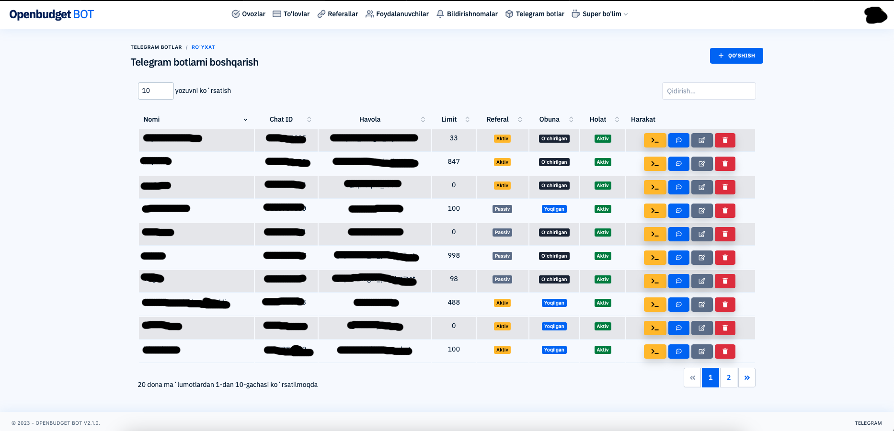

# Openbudget bot controller



## Talablar

PHP: 7.4 yoki undan yuqorisi
MySQL: 5.5 yoki undan yuqorisi
NGINX yoki Apache (Nginx tavsiya etiladi)
SSL&TLS
Tas-Ix tarmoq (agarda tas-ix tarmoq mavjud bo'lmasa revers proxy)

## O'rnatish

1. Loyihaning barcha fayllari `/var/www/html` yoki `public_html` papkasiga ko'chiriladi
```
cp project/* /var/www/html
```
2. `dump.sql` fayli mysqlga yuklash lozim
3. `phpmyadmin` orqali `owners` jadvalidan superadmin uchun `chat_id`-ni kerakli telegram indefikatoriga almashtiring.
4. `phpmyadmin` orqali `settings` jadvalidan `bot_token`,  `channel_id`, `channel_link`, `channel_username` maydonlarini o'zingizga moslang.
5. 4-bosqichda kiritilgan bot uchun loyiha o'rnatilayotgan domenni avtorizatsiya uchun qo'shing.
6. `application/config/database.php` faylidan mysql ma'lumotlarini kiriting.
7. `application/config/config.php` faylidan `base_url` ni loyiha uchun ajratilagn domenga almashtiring.

## VPN sozlamalari

Agarda siz loyihani O'zbekistondan tashqarida bo'lgan serverga o'rnatsangiz siz uchun alohida tas'ix ulanish kerak bo'ladi. Chunki openbudget.uz serverlari uchun tashqi trafiklar cheklangan. Shu sababli ushbu muammodan qochishning eng oson yo'li asosiy server va O'zbekistonda joylashgan istalgan tarmoq orasida tunnel hosil qilish hisoblanadi.

### Serverga openvpn o'rnatish
```
curl -O https://raw.githubusercontent.com/angristan/openvpn-install/master/openvpn-install.sh
chmod +x openvpn-install.sh
./openvpn-install.sh
```

Openvpn server o'rnatilgach `./openvpn-install.sh` fayli orqali revers proxy server uchun alohida profil fayli konfiguratsiya qilinadi.

```
./openvpn-install.sh
Javob: 1
Javob: 1
```

### Mijoz qism

*`config.ovpn` server tomonidan generatsiya qilingan profil fayli*
```
sudo apt-get install openvpn
sudo openvpn --config ~/Downloads/config.ovpn
```

### Proxy server

Mijoz kompyuterda qo'shimcha sifatida proxy server ham o'rnatish lozim.

```
sudo  apt  install  privoxy  -y
```
Proxy serverni sozlash uchun `/etc/privoxy/config` faylidan `listen-address 127.0.0.1:8118` bandini quyidagidek faqatgina port uchun almashtirish lozim: `listen-address :8118`.  Konfiguratsiya qilingach privoxy servisini o'chirib yoqiladi.
```
sudo systemctl restart privoxy
```

### Loyiha uchun proxy 	qo'shish

`application/models/Budget_model.php` faylidan `private $proxy = "10.8.0.2:8118";` qismini o'zingizdagi mos tunnel ip manziliga almashtiring.


## Yakun

Barcha konfiguratsiyalar sozlangach loyiha o'rnatilgan domenga kirish orqali telegram botlarni ulashingiz va ularni bemalol boshqarishingiz mumkin bo'ladi.